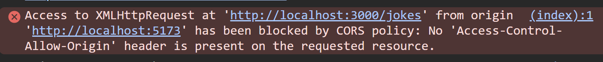

## so here we create a vite project 
` npm create vite@latest . `

dot laga dene se hamara file isi current folder ke ander banaega na ki bahar 

```jsx


PS C:\Users\ujjwal kumar\Desktop\Backend And Frontend\frontend> npm create vite@latest .

> npx
> create-vite .

│
◇  Current directory is not empty. 
│  Please choose how to proceed:
│  Ignore files and continue
│
◇  Select a framework:
│  React
│
◇  Select a variant:
│  JavaScript
│
◇  Which linter to use?
│  ESLint
│
◇  Install with npm and start now?
│  Yes
│
◇  Scaffolding project in C:\Users\ujjwal kumar\Desktop\Backend And Frontend\frontend...
│
◇  Installing dependencies with npm...

added 142 packages, and audited 143 packages in 11s

32 packages are looking for funding
  run `npm fund` for details

found 0 vulnerabilities
│
◇  Starting dev server...

> frontend@0.0.0 dev
> vite


  VITE v8.2.0  ready in 627 ms

  ➜  Local:   http://localhost:5173/
  ➜  Network: use --host to expose
  ➜  press h + enter to show help

```

----

## then we just take the jokes from the backend and loop on that and show 
---

## install the axios becasue it is just like the fetch but it gives some good production level functionalities

`npm i axios`

---

## so we have the problem of CROS


hamara orign same nahi hai isliye probmle aa rha hai like port number ya kuch bhi ider uder hua toh hamara origin same nahi hota hai toh hamara security purpose se allow nahi hota hai usko access karna

### soloutuin is kki ham apne url ko whitelist kar de
### ip whitelist ya domain whitelist jisse hamara url sab ke liye accessiable hoga 